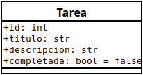

# Lista de tareas

### Descripción
Una api simple que permite crear, ver, actualizar y eliminar tareas.

### Diagrama de Clase


### Tecnologías Utilizadas
- Flask v3.1
- SQLAlchemy v2.0.37
- SQLite v3.45.1

### Entorno de Desarrollo
- **IDE**: Visual Studio Code
- **Sistema Operativo**: Linux Mint 22
- **Base de Datos**: SQLite (usando DBeaver-ce)
- **Control de Versiones**: Git
- **Herramienta para Pruebas de API**: Insomnia

### Instrucciones para Ejecutar el Proyecto

1. Clona el repositorio:
   ```bash
   git clone https://github.com/elidev72/Lista_de_tareas.git
   cd Lista_de_tareas
   ```

2. Crea un entorno virtual:
   ```bash
   python3 -m venv .venv
   source .venv/bin/activate  # En Windows usa `.venv\Scripts\activate`
   ```

3. Instala las dependencias:
   ```bash
   pip install -r requirements.txt
   ```

4. Ejecuta la aplicación:
   ```bash
   python3 run.py 
   ```

5. Probar los endpoints en una herramienta como Insomnia o Postman.

    **Ejemplos de Uso**
    - Crear una Tarea
    
        **POST** `api/crear-tarea`
        ```json
        {
            "titulo": "Comprar agua",
            "descripcion": "No olvidar comprar agua."
        }